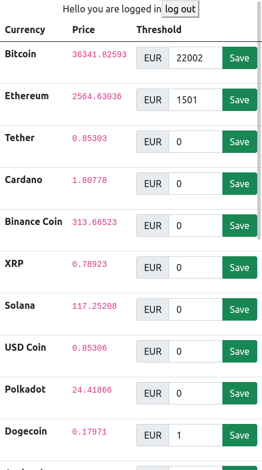

# crypto-pricing-app
Simple app that displays actual crypto prices

## copy the .env files and fill it with the real security keys/api stuff
`cd backend && cp .env.example .env`

## Run application
open two terminals with:
- `cd frontend && npm i && npm start`
- `cd backend && npm i && node index.js`

## TODO
- filter
- search
